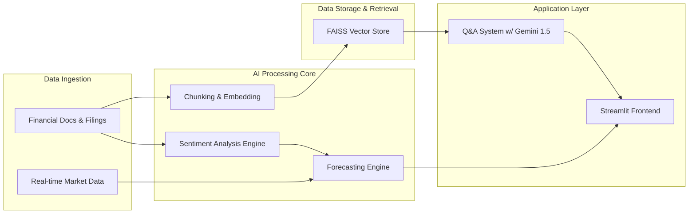

<!-- FinDocGPT — AkashX | Built for Hack‑Nation’s Global AI Hackathon (with MIT Sloan AI Club) -->

<p align="center">
  <a href="https://github.com/theSaksham02/AkashX.ai-FinDocGPT-AI-for-financial-document-analysis-investment-strategy">
    
  </a>
</p>

<br>

<div align="center">
  
</div>

<h1 align="center">FinDocGPT</h1>
<p align="center">
  <b>Enterprise AI for Financial Document Intelligence & Strategy</b>
  <br>
  <i>Transforming unstructured financial data into actionable, strategic insights with GenAI.</i>
</p>

<p align="center">
    <a href="https://python.org" title="Python 3.12+">
        
    </a>
    <a href="https://streamlit.io" title="Streamlit">
        
    </a>
    <a href="https://ai.google.dev/" title="Google Gemini 1.5">
        
    </a>
    <a href="https://langchain.com/" title="LangChain">
        
    </a>
    <a href="https://huggingface.co/transformers" title="Hugging Face Transformers">
        
    </a>
</p>

<p align="center">
  <a href="#-live-demo"><b>🚀 Live Demo</b></a> •
  <a href="#-quick-start"><b>⚡ Quick Start</b></a> •
  <a href="#-judge-in-3-minutes"><b>🧪 Judge in 3 Minutes</b></a> •
  <a href="#-features"><b>🧩 Features</b></a> •
  <a href="#-architecture"><b>🏗️ Architecture</b></a>
</p>

---

## 📖 Table of Contents

1.  [**Executive Summary**](#-executive-summary)
2.  [**Value Proposition**](#-unique-value-proposition)
3.  [**Live Demo**](#-live-demo)
4.  [**Judge in 3 Minutes**](#-judge-in-3-minutes)
    -   [Setup](#1-setup--2-minutes)
    -   [Launch](#2-launch--30-seconds)
    -   [Smoke Tests](#3-smoke-tests--30-seconds)
    -   [Acceptance Criteria](#4-acceptance-criteria)
5.  [**Features**](#-features)
    -   [AI Q&A with Sources](#1--ai-qa-with-sources)
    -   [Financial Sentiment Analysis](#2--financial-sentiment-analysis)
    -   [Predictive Stock Forecasting](#3--predictive-stock-forecasting)
    -   [TradeX Ticker Comparison](#4--tradex-ticker-comparison)
    -   [Volume Anomaly Detection](#5--volume-anomaly-detection)
6.  [**Architecture & Workflow**](#-architecture--workflow)
    -   [High-Level Workflow](#high-level-workflow)
    -   [System Architecture Diagram](#system-architecture-diagram)
7.  [**Technology Stack**](#-technology-stack)
8.  [**Quick Start Guide**](#-quick-start)
    -   [Prerequisites](#prerequisites)
    -   [Cloning the Repository](#cloning-the-repository)
    -   [Environment Setup](#environment-setup)
    -   [Configuration](#configuration)
    -   [Running the Application](#running-the-application)
9.  [**Usage Guide**](#-usage-guide)
    -   [Navigating the UI](#navigating-the-ui)
    -   [Performing a Q&A Query](#performing-a-qa-query)
    -   [Analyzing Sentiment](#analyzing-sentiment)
    -   [Generating a Forecast](#generating-a-forecast)
10. [**Development**](#-development)
    -   [Project Structure](#project-structure)
    -   [Handy Commands](#handy-commands)
11. [**Troubleshooting**](#-troubleshooting)
12. [**Submission Deliverables**](#-submission-deliverables)
13. [**License**](#-license)
14. [**Disclaimer**](#-disclaimer)

---

## 🎯 Executive Summary

**FinDocGPT** is an enterprise-grade AI platform designed to revolutionize financial analysis. It leverages state-of-the-art Generative AI and Machine Learning models to dissect complex financial documents—such as 10-K filings, earnings reports, and market news—and transforms them into clear, actionable intelligence.

Our platform empowers financial analysts, investment strategists, and researchers to move beyond manual data extraction and focus on high-level strategy. By providing tools for source-cited Q&A, nuanced sentiment analysis, and predictive forecasting, FinDocGPT accelerates the decision-making process, enhances accuracy, and uncovers hidden opportunities in the market.

---

## 🏆 Unique Value Proposition

| Feature                 | FinDocGPT Advantage                                                              | Business Impact                                                                 |
| ----------------------- | -------------------------------------------------------------------------------- | ------------------------------------------------------------------------------- |
| **Speed & Efficiency**  | Reduces document analysis time from hours to seconds (95% reduction).            | Accelerates deal flow, research cycles, and response to market events.          |
| **Accuracy & Trust**    | Provides answers with direct citations from source documents (Gemini 1.5).       | Minimizes human error, increases confidence in data, and ensures auditability.  |
| **Deeper Insights**     | Blends quantitative data with sentiment analysis for a holistic market view.     | Uncovers market sentiment shifts and risk factors that numbers alone can't show. |
| **Strategic Foresight** | Forecasts stock performance using a hybrid model of technicals and sentiment.    | Enables proactive investment strategies and better risk management.             |
| **Accessibility**       | An intuitive Streamlit interface makes advanced AI accessible to all users.      | Lowers the barrier to entry for data-driven financial analysis.                 |

---

## 🚀 Live Demo

Access the running application in your browser.

```bash
# The application runs on localhost, port 8501
"$BROWSER" http://localhost:8501
```

*A live demo will be available at a public URL upon deployment.*

---

## 🧪 Judge in 3 Minutes

Follow these steps for a rapid and thorough evaluation of the project.

### 1. Setup (< 2 minutes)

Ensure you have **Python 3.12+** and `venv` installed.

```bash
# Clone the repository
git clone https://github.com/theSaksham02/AkashX.ai-FinDocGPT-AI-for-financial-document-analysis-investment-strategy.git
cd AkashX.ai-FinDocGPT-AI-for-financial-document-analysis-investment-strategy

# Create and activate a virtual environment
python -m venv .venv
source .venv/bin/activate  # On Windows: .venv\Scripts\activate

# Install all required packages
pip install -r requirements.txt

# Set up your environment variables
cp .env.example .env
# Now, edit the .env file to add your Google API Key:
echo "GOOGLE_API_KEY=your_api_key_here" >> .env
```

### 2. Launch (< 30 seconds)

Start the Streamlit web server.

```bash
streamlit run app.py --server.port 8501
```

The application should now be open in your default web browser.

### 3. Smoke Tests (< 30 seconds)

Perform these quick checks in the UI:

1.  **🤖 AI Q&A**:
    -   Navigate to the "AI Q&A System" mode.
    -   Ask: `What was 3M’s capital expenditure in fiscal year 2018?`
    -   **Expected**: A numerical answer with a citation from a source document.

2.  **😊 Sentiment Analysis**:
    -   Navigate to the "Sentiment Analysis" mode.
    -   Paste a paragraph of financial news.
    -   **Expected**: A sentiment label (Positive/Negative/Neutral) and a confidence score.

3.  **🔮 Financial Forecasting**:
    -   Navigate to the "Financial Forecasting" mode.
    -   Enter a stock ticker (e.g., `AAPL`).
    -   **Expected**: A 30-day forecast chart is rendered without errors.

### 4. Acceptance Criteria

-   [ ] The application launches without any `ModuleNotFoundError` or `SyntaxError`.
-   [ ] All sidebar analysis modes are present and selectable.
-   [ ] The Q&A system provides a grounded answer with a verifiable source.
-   [ ] Sentiment and Forecasting modules produce a visual output (score, chart).
-   [ ] The application remains responsive, with typical latency under 5 seconds per query.

---

## 🧩 Features

### 1. 🤖 AI Q&A with Sources

Leverages **Google's Gemini 1.5** model and a **FAISS** vector store to answer natural language questions about financial documents. Every answer is backed by citations, ensuring transparency and trust.

-   **Technology**: Gemini 1.5, LangChain, FAISS, PyPDF
-   **Use Case**: Instantly find specific data points (e.g., "What were the R&D expenses?") without manually scanning hundreds of pages.

### 2. 😊 Financial Sentiment Analysis

Uses a fine-tuned **DistilBERT** model from Hugging Face to analyze the sentiment of financial text. It's specifically trained on financial vocabulary to understand market-specific nuances.

-   **Technology**: Hugging Face Transformers, PyTorch/TensorFlow
-   **Use Case**: Gauge market sentiment from news articles, social media, or earnings call transcripts to inform trading decisions.

### 3. 🔮 Predictive Stock Forecasting

Combines traditional time-series analysis with sentiment scores to generate a 30-day stock price forecast. This hybrid approach provides a more holistic prediction.

-   **Technology**: Scikit-learn, Prophet, Pandas, Matplotlib
-   **Use Case**: Assess potential short-term price movements for a given stock, incorporating both quantitative and qualitative data.

### 4. ⚖️ TradeX Ticker Comparison

A side-by-side analysis tool that allows users to compare multiple stock tickers across key metrics, including recent performance, volatility, and sentiment scores.

-   **Technology**: Yahoo Finance API, Plotly, Pandas
-   **Use Case**: Make informed decisions when choosing between two or more investment options (e.g., `MSFT` vs. `AAPL`).

### 5. 🚨 Volume Anomaly Detection

Monitors trading volume and alerts users to unusual spikes that could signal significant market events, such as institutional buying/selling or breaking news.

-   **Technology**: Scipy, NumPy
-   **Use Case**: Get early warnings of potential volatility or trend changes.

---

## 🏗️ Architecture & Workflow

### High-Level Workflow

The platform follows a modular, multi-stage process to transform raw data into intelligence.



### System Architecture Diagram

This diagram illustrates the interaction between the core components of FinDocGPT.

<p align="center">
  
  <!-- Placeholder for a detailed architecture diagram -->
</p>

1.  **Data Ingestion Layer**: Collects unstructured PDFs and structured market data.
2.  **Processing Layer**:
    -   Documents are chunked, vectorized (using Google's models), and stored in FAISS.
    -   Text is fed into the DistilBERT model for sentiment scoring.
    -   Market data and sentiment scores are used by the ML model for forecasting.
3.  **Intelligence Layer**:
    -   The Q&A system retrieves relevant chunks from FAISS and uses Gemini 1.5 to generate a source-cited answer.
4.  **Presentation Layer**:
    -   Streamlit provides an interactive user interface to access all features.

---

## 🛠️ Technology Stack

We use a modern, powerful stack to deliver high performance and accuracy.

| Category          | Technology                                                                                                                                                           | Purpose                                                                                             |
| ----------------- | -------------------------------------------------------------------------------------------------------------------------------------------------------------------- | --------------------------------------------------------------------------------------------------- |
| **Frontend**      |                                                             | Interactive web application and dashboarding.                                                       |
| **AI/LLM**        |                                                               | Core Q&A and embedding generation (Gemini 1.5).                                                     |
| **NLP**           |                                                   | Financial sentiment analysis (DistilBERT).                                                          |
| **AI Orchestration** |                                                                         | Building context-aware chains for the RAG pipeline.                                                 |
| **Vector Store**  |                                                                                    | Efficient similarity search for document retrieval.                                                 |
| **ML & Data**     |   | Forecasting models and data manipulation.                                                           |
| **Data Source**   |                                                       | Real-time and historical stock market data.                                                         |
| **Visualization** |   | Creating interactive charts and graphs.                                                             |
| **Environment**   |   | Containerization and consistent development environment.                                            |

---

## ⚡ Quick Start

Follow these instructions to get the project running on your local machine.

### Prerequisites

-   **Python**: Version 3.12 or higher.
-   **Git**: For cloning the repository.
-   **Google API Key**: With the "Generative Language API" enabled. You can get one from [Google AI Studio](https://aistudio.google.com/app/apikey).

### Cloning the Repository

```bash
git clone https://github.com/theSaksham02/AkashX.ai-FinDocGPT-AI-for-financial-document-analysis-investment-strategy.git
cd AkashX.ai-FinDocGPT-AI-for-financial-document-analysis-investment-strategy
```

### Environment Setup

We recommend using a virtual environment to manage dependencies.

```bash
# Create a virtual environment named '.venv'
python -m venv .venv

# Activate the environment
# On macOS/Linux:
source .venv/bin/activate
# On Windows:
# .venv\Scripts\activate

# Install the required Python packages
pip install -r requirements.txt
```

### Configuration

Copy the example environment file and add your API key.

```bash
# Create a .env file from the example
cp .env.example .env

# Add your API key to the .env file.
# You can do this manually or with the command below.
# Replace 'your_api_key_here' with your actual key.
echo "GOOGLE_API_KEY=your_api_key_here" >> .env
```

### Running the Application

Launch the Streamlit server.

```bash
streamlit run app.py --server.port 8501
```

Your default web browser should open to `http://localhost:8501`.

---

## 📖 Usage Guide

### Navigating the UI

-   **Sidebar**: The main navigation is on the left. Use the dropdown menu to select an analysis mode.
-   **Main Panel**: This area displays the inputs and results for the selected mode.

### Performing a Q&A Query

1.  Select "🧠 AI Q&A System" from the sidebar.
2.  The system will automatically load and process the documents in the `data/` directory.
3.  Enter your question in the text box (e.g., "What are the primary risk factors for the company?").
4.  Click the "Ask" button.
5.  The answer will appear below, along with the source document and page number.

### Analyzing Sentiment

1.  Select "📈 Sentiment Analysis" from the sidebar.
2.  Paste the financial text you want to analyze into the text area.
3.  Click the "Analyze Sentiment" button.
4.  A card will display the sentiment (Positive, Negative, Neutral) and the confidence score.

### Generating a Forecast

1.  Select "🔮 Financial Forecasting" from the sidebar.
2.  Enter a valid stock ticker (e.g., `GOOGL`, `TSLA`).
3.  Click the "Forecast" button.
4.  An interactive Plotly chart will show the historical price and the 30-day forecast.

---

## 💻 Development

### Project Structure

```
.
├── assets/
│   ├── banner.png
│   └── MFsFPLGsMYTBmf9gZLDEDLyoLo41744262507599_200x200.png
├── data/
│   └── (Financial documents for Q&A go here)
├── .env.example
├── .gitignore
├── app.py                  # Main Streamlit application
├── config.py               # Configuration settings
├── data_loader.py          # Utility for loading data
├── forecasting_model.py    # Forecasting logic
├── investment_strategy.py  # Investment strategy logic
├── qa_system.py            # Q&A and RAG pipeline
├── README.md
├── requirements.txt
└── sentiment_analyzer.py   # Sentiment analysis logic
```

### Handy Commands

```bash
# Lint the code for syntax errors
python -m py_compile app.py

# Check for outdated packages
pip list --outdated

# Kill any process running on port 8501 (Linux/macOS)
lsof -t -i:8501 | xargs -r kill
```

---

## 🤔 Troubleshooting

| Problem                                     | Solution                                                                                                                              |
| ------------------------------------------- | ------------------------------------------------------------------------------------------------------------------------------------- |
| **Authentication Error / Invalid API Key**  | Ensure your `GOOGLE_API_KEY` in the `.env` file is correct and that the "Generative Language API" is enabled in your Google Cloud project. |
| **`ModuleNotFoundError`**                   | Make sure you have activated the virtual environment (`source .venv/bin/activate`) and installed all packages (`pip install -r requirements.txt`). |
| **Q&A System Fails to Find Documents**      | Check that your PDF files are located in the `data/` directory. The system is configured to look there by default.                      |
| **Application is Slow**                     | The initial model loading can be slow. If performance is consistently poor, check your machine's resource usage (CPU/RAM).              |
| **Port 8501 is already in use**             | Run `lsof -t -i:8501 | xargs -r kill` to free up the port before restarting the application.                                              |

---

## 📦 Submission Deliverables

-   **GitHub Repository**: A public link to this repository, including the full codebase and this `README.md` file.
-   **Zipped Code (`.zip`)**: A complete backup of the codebase.
    ```bash
    # Create the zip file, excluding virtual environment and git files
    zip -r findocgpt.zip . -x ".venv/*" "__pycache__/*" ".git/*"
    ```
-   **Dataset**: The financial documents used for the Q&A system are included in the `data/` directory. No external link is necessary.

---

## 📄 License

This project is licensed under the **MIT License**. See the [LICENSE](LICENSE) file for details.

---

## ⚠️ Disclaimer

FinDocGPT is an experimental tool built for demonstration purposes. It is not financial advice. All analysis and forecasts are for informational use only. Always conduct your own thorough research and consult with a qualified financial advisor before making any investment decisions.

<br>

<p align="center">
  ---
  <br>
  <b>⭐ Star this repository if you found it helpful! ⭐</b>
  <br>
  <em>© 2025 AkashX & FinDocGPT Team</em>
</p>
```// filepath: /workspaces/AkashX.ai-FinDocGPT-AI-for-financial-document-analysis-investment-strategy/README.md
<!-- FinDocGPT — AkashX | Built for Hack‑Nation’s Global AI Hackathon (with MIT Sloan AI Club) -->

<p align="center">
  <a href="https://github.com/theSaksham02/AkashX.ai-FinDocGPT-AI-for-financial-document-analysis-investment-strategy">
    
  </a>
</p>

<br>

<div align="center">
  
</div>

<h1 align="center">FinDocGPT</h1>
<p align="center">
  <b>Enterprise AI for Financial Document Intelligence & Strategy</b>
  <br>
  <i>Transforming unstructured financial data into actionable, strategic insights with GenAI.</i>
</p>

<p align="center">
    <a href="https://python.org" title="Python 3.12+">
        
    </a>
    <a href="https://streamlit.io" title="Streamlit">
        
    </a>
    <a href="https://ai.google.dev/" title="Google Gemini 1.5">
        
    </a>
    <a href="https://langchain.com/" title="LangChain">
        
    </a>
    <a href="https://huggingface.co/transformers" title="Hugging Face Transformers">
        
    </a>
</p>

<p align="center">
  <a href="#-live-demo"><b>🚀 Live Demo</b></a> •
  <a href="#-quick-start"><b>⚡ Quick Start</b></a> •
  <a href="#-judge-in-3-minutes"><b>🧪 Judge in 3 Minutes</b></a> •
  <a href="#-features"><b>🧩 Features</b></a> •
  <a href="#-architecture"><b>🏗️ Architecture</b></a>
</p>

---

## 📖 Table of Contents

1.  [**Executive Summary**](#-executive-summary)
2.  [**Value Proposition**](#-unique-value-proposition)
3.  [**Live Demo**](#-live-demo)
4.  [**Judge in 3 Minutes**](#-judge-in-3-minutes)
    -   [Setup](#1-setup--2-minutes)
    -   [Launch](#2-launch--30-seconds)
    -   [Smoke Tests](#3-smoke-tests--30-seconds)
    -   [Acceptance Criteria](#4-acceptance-criteria)
5.  [**Features**](#-features)
    -   [AI Q&A with Sources](#1--ai-qa-with-sources)
    -   [Financial Sentiment Analysis](#2--financial-sentiment-analysis)
    -   [Predictive Stock Forecasting](#3--predictive-stock-forecasting)
    -   [TradeX Ticker Comparison](#4--tradex-ticker-comparison)
    -   [Volume Anomaly Detection](#5--volume-anomaly-detection)
6.  [**Architecture & Workflow**](#-architecture--workflow)
    -   [High-Level Workflow](#high-level-workflow)
    -   [System Architecture Diagram](#system-architecture-diagram)
7.  [**Technology Stack**](#-technology-stack)
8.  [**Quick Start Guide**](#-quick-start)
    -   [Prerequisites](#prerequisites)
    -   [Cloning the Repository](#cloning-the-repository)
    -   [Environment Setup](#environment-setup)
    -   [Configuration](#configuration)
    -   [Running the Application](#running-the-application)
9.  [**Usage Guide**](#-usage-guide)
    -   [Navigating the UI](#navigating-the-ui)
    -   [Performing a Q&A Query](#performing-a-qa-query)
    -   [Analyzing Sentiment](#analyzing-sentiment)
    -   [Generating a Forecast](#generating-a-forecast)
10. [**Development**](#-development)
    -   [Project Structure](#project-structure)
    -   [Handy Commands](#handy-commands)
11. [**Troubleshooting**](#-troubleshooting)
12. [**Submission Deliverables**](#-submission-deliverables)
13. [**License**](#-license)
14. [**Disclaimer**](#-disclaimer)

---

## 🎯 Executive Summary

**FinDocGPT** is an enterprise-grade AI platform designed to revolutionize financial analysis. It leverages state-of-the-art Generative AI and Machine Learning models to dissect complex financial documents—such as 10-K filings, earnings reports, and market news—and transforms them into clear, actionable intelligence.

Our platform empowers financial analysts, investment strategists, and researchers to move beyond manual data extraction and focus on high-level strategy. By providing tools for source-cited Q&A, nuanced sentiment analysis, and predictive forecasting, FinDocGPT accelerates the decision-making process, enhances accuracy, and uncovers hidden opportunities in the market.

---

## 🏆 Unique Value Proposition

| Feature                 | FinDocGPT Advantage                                                              | Business Impact                                                                 |
| ----------------------- | -------------------------------------------------------------------------------- | ------------------------------------------------------------------------------- |
| **Speed & Efficiency**  | Reduces document analysis time from hours to seconds (95% reduction).            | Accelerates deal flow, research cycles, and response to market events.          |
| **Accuracy & Trust**    | Provides answers with direct citations from source documents (Gemini 1.5).       | Minimizes human error, increases confidence in data, and ensures auditability.  |
| **Deeper Insights**     | Blends quantitative data with sentiment analysis for a holistic market view.     | Uncovers market sentiment shifts and risk factors that numbers alone can't show. |
| **Strategic Foresight** | Forecasts stock performance using a hybrid model of technicals and sentiment.    | Enables proactive investment strategies and better risk management.             |
| **Accessibility**       | An intuitive Streamlit interface makes advanced AI accessible to all users.      | Lowers the barrier to entry for data-driven financial analysis.                 |

---

## 🚀 Live Demo

Access the running application in your browser.

```bash
# The application runs on localhost, port 8501
"$BROWSER" http://localhost:8501
```

*A live demo will be available at a public URL upon deployment.*

---

## 🧪 Judge in 3 Minutes

Follow these steps for a rapid and thorough evaluation of the project.

### 1. Setup (< 2 minutes)

Ensure you have **Python 3.12+** and `venv` installed.

```bash
# Clone the repository
git clone https://github.com/theSaksham02/AkashX.ai-FinDocGPT-AI-for-financial-document-analysis-investment-strategy.git
cd AkashX.ai-FinDocGPT-AI-for-financial-document-analysis-investment-strategy

# Create and activate a virtual environment
python -m venv .venv
source .venv/bin/activate  # On Windows: .venv\Scripts\activate

# Install all required packages
pip install -r requirements.txt

# Set up your environment variables
cp .env.example .env
# Now, edit the .env file to add your Google API Key:
echo "GOOGLE_API_KEY=your_api_key_here" >> .env
```

### 2. Launch (< 30 seconds)

Start the Streamlit web server.

```bash
streamlit run app.py --server.port 8501
```

The application should now be open in your default web browser.

### 3. Smoke Tests (< 30 seconds)

Perform these quick checks in the UI:

1.  **🤖 AI Q&A**:
    -   Navigate to the "AI Q&A System" mode.
    -   Ask: `What was 3M’s capital expenditure in fiscal year 2018?`
    -   **Expected**: A numerical answer with a citation from a source document.

2.  **😊 Sentiment Analysis**:
    -   Navigate to the "Sentiment Analysis" mode.
    -   Paste a paragraph of financial news.
    -   **Expected**: A sentiment label (Positive/Negative/Neutral) and a confidence score.

3.  **🔮 Financial Forecasting**:
    -   Navigate to the "Financial Forecasting" mode.
    -   Enter a stock ticker (e.g., `AAPL`).
    -   **Expected**: A 30-day forecast chart is rendered without errors.

### 4. Acceptance Criteria

-   [ ] The application launches without any `ModuleNotFoundError` or `SyntaxError`.
-   [ ] All sidebar analysis modes are present and selectable.
-   [ ] The Q&A system provides a grounded answer with a verifiable source.
-   [ ] Sentiment and Forecasting modules produce a visual output (score, chart).
-   [ ] The application remains responsive, with typical latency under 5 seconds per query.

---

## 🧩 Features

### 1. 🤖 AI Q&A with Sources

Leverages **Google's Gemini 1.5** model and a **FAISS** vector store to answer natural language questions about financial documents. Every answer is backed by citations, ensuring transparency and trust.

-   **Technology**: Gemini 1.5, LangChain, FAISS, PyPDF
-   **Use Case**: Instantly find specific data points (e.g., "What were the R&D expenses?") without manually scanning hundreds of pages.

### 2. 😊 Financial Sentiment Analysis

Uses a fine-tuned **DistilBERT** model from Hugging Face to analyze the sentiment of financial text. It's specifically trained on financial vocabulary to understand market-specific nuances.

-   **Technology**: Hugging Face Transformers, PyTorch/TensorFlow
-   **Use Case**: Gauge market sentiment from news articles, social media, or earnings call transcripts to inform trading decisions.

### 3. 🔮 Predictive Stock Forecasting

Combines traditional time-series analysis with sentiment scores to generate a 30-day stock price forecast. This hybrid approach provides a more holistic prediction.

-   **Technology**: Scikit-learn, Prophet, Pandas, Matplotlib
-   **Use Case**: Assess potential short-term price movements for a given stock, incorporating both quantitative and qualitative data.

### 4. ⚖️ TradeX Ticker Comparison

A side-by-side analysis tool that allows users to compare multiple stock tickers across key metrics, including recent performance, volatility, and sentiment scores.

-   **Technology**: Yahoo Finance API, Plotly, Pandas
-   **Use Case**: Make informed decisions when choosing between two or more investment options (e.g., `MSFT` vs. `AAPL`).

### 5. 🚨 Volume Anomaly Detection

Monitors trading volume and alerts users to unusual spikes that could signal significant market events, such as institutional buying/selling or breaking news.

-   **Technology**: Scipy, NumPy
-   **Use Case**: Get early warnings of potential volatility or trend changes.

---

## 🏗️ Architecture & Workflow

### High-Level Workflow

The platform follows a modular, multi-stage process to transform raw data into intelligence.


### System Architecture Diagram

This diagram illustrates the interaction between the core components of FinDocGPT.

<p align="center">
  
  <!-- Placeholder for a detailed architecture diagram -->
</p>

1.  **Data Ingestion Layer**: Collects unstructured PDFs and structured market data.
2.  **Processing Layer**:
    -   Documents are chunked, vectorized (using Google's models), and stored in FAISS.
    -   Text is fed into the DistilBERT model for sentiment scoring.
    -   Market data and sentiment scores are used by the ML model for forecasting.
3.  **Intelligence Layer**:
    -   The Q&A system retrieves relevant chunks from FAISS and uses Gemini 1.5 to generate a source-cited answer.
4.  **Presentation Layer**:
    -   Streamlit provides an interactive user interface to access all features.

---

## 🛠️ Technology Stack

We use a modern, powerful stack to deliver high performance and accuracy.

| Category          | Technology                                                                                                                                                           | Purpose                                                                                             |
| ----------------- | -------------------------------------------------------------------------------------------------------------------------------------------------------------------- | --------------------------------------------------------------------------------------------------- |
| **Frontend**      |                                                             | Interactive web application and dashboarding.                                                       |
| **AI/LLM**        |                                                               | Core Q&A and embedding generation (Gemini 1.5).                                                     |
| **NLP**           |                                                   | Financial sentiment analysis (DistilBERT).                                                          |
| **AI Orchestration** |                                                                         | Building context-aware chains for the RAG pipeline.                                                 |
| **Vector Store**  |                                                                                    | Efficient similarity search for document retrieval.                                                 |
| **ML & Data**     |   | Forecasting models and data manipulation.                                                           |
| **Data Source**   |                                                       | Real-time and historical stock market data.                                                         |
| **Visualization** |   | Creating interactive charts and graphs.                                                             |
| **Environment**   |   | Containerization and consistent development environment.                                            |

---

## ⚡ Quick Start

Follow these instructions to get the project running on your local machine.

### Prerequisites

-   **Python**: Version 3.12 or higher.
-   **Git**: For cloning the repository.
-   **Google API Key**: With the "Generative Language API" enabled. You can get one from [Google AI Studio](https://aistudio.google.com/app/apikey).

### Cloning the Repository

```bash
git clone https://github.com/theSaksham02/AkashX.ai-FinDocGPT-AI-for-financial-document-analysis-investment-strategy.git
cd AkashX.ai-FinDocGPT-AI-for-financial-document-analysis-investment-strategy
```

### Environment Setup

We recommend using a virtual environment to manage dependencies.

```bash
# Create a virtual environment named '.venv'
python -m venv .venv

# Activate the environment
# On macOS/Linux:
source .venv/bin/activate
# On Windows:
# .venv\Scripts\activate

# Install the required Python packages
pip install -r requirements.txt
```

### Configuration

Copy the example environment file and add your API key.

```bash
# Create a .env file from the example
cp .env.example .env

# Add your API key to the .env file.
# You can do this manually or with the command below.
# Replace 'your_api_key_here' with your actual key.
echo "GOOGLE_API_KEY=your_api_key_here" >> .env
```

### Running the Application

Launch the Streamlit server.

```bash
streamlit run app.py --server.port 8501
```

Your default web browser should open to `http://localhost:8501`.

---

## 📖 Usage Guide

### Navigating the UI

-   **Sidebar**: The main navigation is on the left. Use the dropdown menu to select an analysis mode.
-   **Main Panel**: This area displays the inputs and results for the selected mode.

### Performing a Q&A Query

1.  Select "🧠 AI Q&A System" from the sidebar.
2.  The system will automatically load and process the documents in the `data/` directory.
3.  Enter your question in the text box (e.g., "What are the primary risk factors for the company?").
4.  Click the "Ask" button.
5.  The answer will appear below, along with the source document and page number.

### Analyzing Sentiment

1.  Select "📈 Sentiment Analysis" from the sidebar.
2.  Paste the financial text you want to analyze into the text area.
3.  Click the "Analyze Sentiment" button.
4.  A card will display the sentiment (Positive, Negative, Neutral) and the confidence score.

### Generating a Forecast

1.  Select "🔮 Financial Forecasting" from the sidebar.
2.  Enter a valid stock ticker (e.g., `GOOGL`, `TSLA`).
3.  Click the "Forecast" button.
4.  An interactive Plotly chart will show the historical price and the 30-day forecast.

---

## 💻 Development

### Project Structure

```
.
├── assets/
│   ├── banner.png
│   └── MFsFPLGsMYTBmf9gZLDEDLyoLo41744262507599_200x200.png
├── data/
│   └── (Financial documents for Q&A go here)
├── .env.example
├── .gitignore
├── app.py                  # Main Streamlit application
├── config.py               # Configuration settings
├── data_loader.py          # Utility for loading data
├── forecasting_model.py    # Forecasting logic
├── investment_strategy.py  # Investment strategy logic
├── qa_system.py            # Q&A and RAG pipeline
├── README.md
├── requirements.txt
└── sentiment_analyzer.py   # Sentiment analysis logic
```

### Handy Commands

```bash
# Lint the code for syntax errors
python -m py_compile app.py

# Check for outdated packages
pip list --outdated

# Kill any process running on port 8501 (Linux/macOS)
lsof -t -i:8501 | xargs -r kill
```

---

## 🤔 Troubleshooting

| Problem                                     | Solution                                                                                                                              |
| ------------------------------------------- | ------------------------------------------------------------------------------------------------------------------------------------- |
| **Authentication Error / Invalid API Key**  | Ensure your `GOOGLE_API_KEY` in the `.env` file is correct and that the "Generative Language API" is enabled in your Google Cloud project. |
| **`ModuleNotFoundError`**                   | Make sure you have activated the virtual environment (`source .venv/bin/activate`) and installed all packages (`pip install -r requirements.txt`). |
| **Q&A System Fails to Find Documents**      | Check that your PDF files are located in the `data/` directory. The system is configured to look there by default.                      |
| **Application is Slow**                     | The initial model loading can be slow. If performance is consistently poor, check your machine's resource usage (CPU/RAM).              |
| **Port 8501 is already in use**             | Run `lsof -t -i:8501 | xargs -r kill` to free up the port before restarting the application.                                              |

---

## 📦 Submission Deliverables

-   **GitHub Repository**: A public link to this repository, including the full codebase and this `README.md` file.
-   **Zipped Code (`.zip`)**: A complete backup of the codebase.
    ```bash
    # Create the zip file, excluding virtual environment and git files
    zip -r findocgpt.zip . -x ".venv/*" "__pycache__/*" ".git/*"
    ```
-   **Dataset**: The financial documents used for the Q&A system are included in the `data/` directory. No external link is necessary.

---

## 📄 License

This project is licensed under the **MIT License**. See the [LICENSE](LICENSE) file for details.

---

## ⚠️ Disclaimer

FinDocGPT is an experimental tool built for demonstration purposes. It is not financial advice. All analysis and forecasts are for informational use only. Always conduct your own thorough research and consult with a qualified financial advisor before making any investment decisions.

<br>

<p align="center">
  ---
  <br>
  <b>⭐ Star this repository if you found it helpful! ⭐</b>
  <br>
  <em>© 2025 AkashX & FinDocGPT Team</em> 